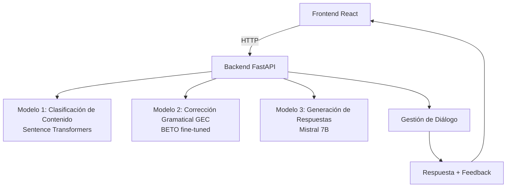

# 🗣️ Conversationally Desktop – Tutor de idiomas con IA para Debian

> Basado en **Conversationally**, el proyecto ganador del capstone de UC Berkeley: un tutor conversacional de idiomas con IA.  
> Repositorio original: [team-langbot/conversationally](https://github.com/team-langbot/conversationally)

**Conversationally Desktop** es una adaptación local del aclamado tutor de idiomas conversacional creado por un equipo de la Maestría en Ciencia de Datos de UC Berkeley. Esta versión reimplementa la arquitectura original (basada en AWS) para que puedas ejecutarla **directamente en tu máquina Debian** (o cualquier Linux con Docker), sin depender de la nube, manteniendo toda la potencia de los modelos de NLP.

---

## 🎯 ¿Qué hace Conversationally?

Conversationally te permite mantener conversaciones en español (u otros idiomas) con un bot inteligente que:

- **Mantiene el tema** de la conversación para que no te desvíes del objetivo de aprendizaje.
- **Detecta errores gramaticales** de concordancia de género y número (y potencialmente otros).
- **Genera pistas (scaffolding)** cuando cometes un error, ayudándote a autocorregirte sin darte la respuesta directamente.

Todo esto ocurre en una interfaz web sencilla, accesible desde tu navegador.

---

## 🧠 Arquitectura del sistema

Esta versión local replica la arquitectura original utilizando componentes open-source y ejecutándose en tu propio hardware.



### Componentes principales:

| Componente | Tecnología | Función |
|------------|------------|---------|
| **Frontend** | React (desde `langbot-ui`) | Interfaz de chat web |
| **Backend** | FastAPI (Python) | Orquesta los modelos y gestiona la lógica de conversación |
| **Modelo de Contenido** | Sentence Transformers (`paraphrase-multilingual-MiniLM-L12-v2`) | Calcula similitud coseno entre el mensaje del usuario y el tema esperado |
| **Modelo GEC** | BETO (Spanish BERT) fine-tuned con COWS-L2H | Clasifica cada token en: correcto, error de género, error de número |
| **Modelo Generador** | Mistral 7B Instruct (cuantizado) | Produce respuestas y pistas contextuales |

---

## 📁 Estructura del repositorio

```
conversationally-desktop/
├── backend/
│   ├── app/
│   │   ├── main.py                 # Punto de entrada FastAPI
│   │   ├── models/                  # Carga e inferencia de modelos
│   │   │   ├── content.py            # Sentence Transformers
│   │   │   ├── gec.py                # Modelo BETO para GEC
│   │   │   └── generator.py          # Mistral 7B (vía transformers o llama.cpp)
│   │   ├── routers/                  # Endpoints de la API
│   │   │   └── chat.py
│   │   └── schemas/                  # Pydantic models
│   ├── requirements.txt
│   ├── Dockerfile
│   └── .env.example
├── frontend/
│   ├── (código fuente de langbot-ui adaptado)
│   ├── package.json
│   ├── Dockerfile
│   └── nginx.conf
├── models/                            # (Opcional) Pesos descargados localmente
│   ├── sentence-transformer/
│   ├── beto-gec/
│   └── mistral-7b-instruct-v0.2.Q4_K_M.gguf
├── docker-compose.yml
├── Makefile                           # Comandos útiles
├── docs/                               # Documentación adicional
│   ├── desafios.md                     # Explicación de retos técnicos
│   └── creditos.md                      # Atribuciones al equipo original
└── README.md
```

---

## 🚀 Instalación y ejecución en Debian

### Requisitos del sistema

- **Sistema operativo**: Debian 11+ / Ubuntu 20.04+ (cualquier Linux con Docker)
- **Memoria RAM**: Mínimo 8 GB (recomendado 16 GB para Mistral 7B)
- **Espacio en disco**: 10 GB (para modelos y dependencias)
- **Docker y Docker Compose** (opcional pero recomendado)
- **Python 3.10+** y **Node.js 18+** (si se instala manualmente)

### Opción 1: Instalación con Docker (recomendada)

```bash
# 1. Clonar el repositorio
git clone https://github.com/tu-usuario/conversationally-desktop.git
cd conversationally-desktop

# 2. Configurar variables de entorno (opcional)
cp backend/.env.example backend/.env

# 3. Descargar los modelos (automático al construir, pero puedes pre-descargarlos)
make download-models

# 4. Construir y levantar con Docker Compose
docker-compose up --build
```

Una vez que los contenedores estén en ejecución, abre tu navegador en `http://localhost:3000` (o el puerto configurado).

### Opción 2: Instalación manual (para desarrollo)

#### Backend (FastAPI)

```bash
cd backend
python -m venv venv
source venv/bin/activate
pip install -r requirements.txt

# Descargar modelos (ajusta las rutas en .env)
python scripts/download_models.py

# Ejecutar servidor
uvicorn app.main:app --reload --host 0.0.0.0 --port 8000
```

#### Frontend (React)

```bash
cd frontend
npm install
npm start
```

Accede a `http://localhost:3000`.

---

## 🧪 Uso de la aplicación

1. Abre la interfaz web.
2. Selecciona un escenario de conversación (por ejemplo: "En el restaurante", "Presentarte", etc.).
3. Comienza a escribir en español. El bot te responderá y, si cometes un error gramatical, te dará una pista.
4. Puedes ver el análisis de "on-topic" y las correcciones token a token en la consola de desarrollador (o en futuras versiones en la UI).

---

## 🧗 Desafíos y consideraciones técnicas

Este proyecto no es un simple "copiar y pegar". Requiere entender y resolver varios retos:

### 1. **Modelos pesados en local**
   - Mistral 7B necesita al menos 8 GB de RAM en versión cuantizada (GGUF). Para CPU, se recomienda usar [llama.cpp](https://github.com/ggerganov/llama.cpp) con bindings en Python (`llama-cpp-python`). En el backend hemos incluido soporte para cargar modelos GGUF.
   - El modelo GEC (BETO fine-tuned) no está publicado en Hugging Face. Debes entrenarlo tú mismo siguiendo los notebooks originales o contactar a los autores. Como alternativa, hemos incluido un script para fine-tunearlo con el dataset COWS-L2H (ver `backend/scripts/train_gec.py`).

### 2. **Orquestación de tres modelos en tiempo real**
   - La latencia total puede ser alta si no se optimiza. Se recomienda usar asyncio y cargar los modelos en memoria una sola vez.
   - Implementamos caché de respuestas para escenarios comunes.

### 3. **Mantenimiento del estado conversacional**
   - El sistema debe recordar el contexto de la conversación. Usamos una lista de mensajes que se pasa al generador (similar a los `messages` de ChatGPT).

### 4. **Idioma**
   - El proyecto original se centra en español, pero los modelos de Sentence Transformers y Mistral son multilingües. Puedes adaptarlo a otros idiomas cambiando el dataset de GEC y ajustando prompts.

---

## 🤝 Contribuciones

¿Quieres mejorar esta adaptación? ¡Genial! Las áreas donde más ayuda se necesita:

- **Modelo GEC**: Entrenar y subir una versión lista para usar del modelo BETO fine-tuned.
- **Frontend**: Mejorar la UI para mostrar los errores token a token y las pistas de forma más amigable.
- **Optimización**: Reducir el consumo de memoria y acelerar la inferencia.
- **Documentación**: Traducir este README a inglés y crear tutoriales en vídeo.

Por favor, abre un issue o un pull request. Revisa `docs/desafios.md` para más detalles técnicos.

---

## 📜 Créditos y licencia

Este proyecto es una adaptación del trabajo original de:

- **Aastha Khanna**
- **Isabel Chan**
- **Jess Matthews**
- **Mon Young**
- **Ram Senthamarai**

y su repositorio: [team-langbot/conversationally](https://github.com/team-langbot/conversationally)

El código nuevo de esta adaptación está bajo licencia MIT (ver `LICENSE`). Los modelos y datasets utilizados tienen sus propias licencias (consulta la documentación de cada uno).

**Agradecimiento especial** al equipo de UC Berkeley por compartir su increíble proyecto y hacer posible esta versión local.

---

## 📬 Contacto

Si tienes preguntas o sugerencias, abre un issue en GitHub o contacta al mantenedor: [tu-email@ejemplo.com]

---

**¡Disfruta aprendiendo idiomas con IA en tu propia máquina!** 🚀
